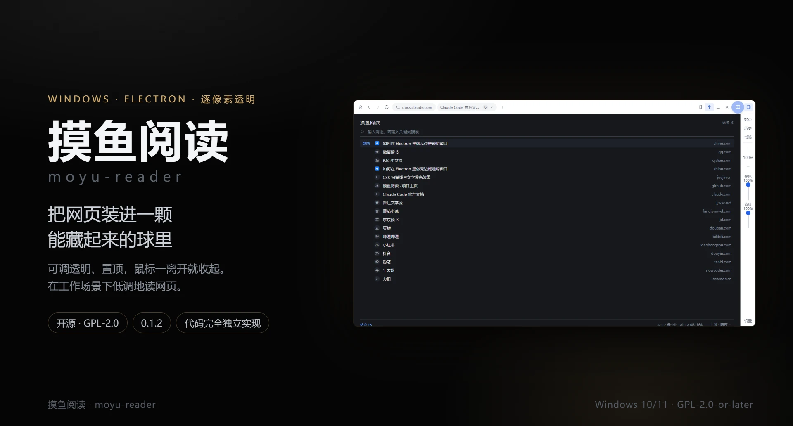
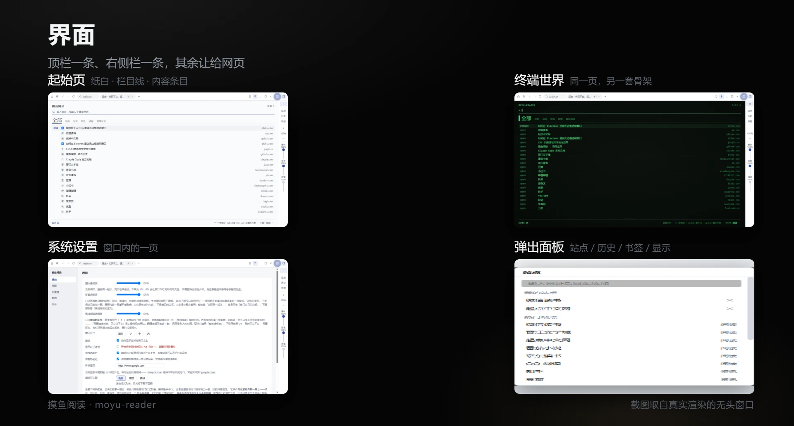
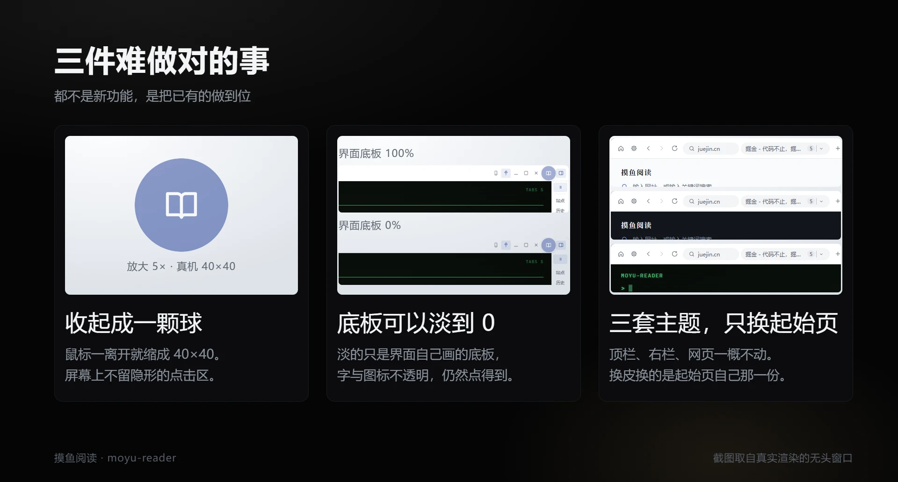

<div align="center">

# 摸鱼阅读

**把网页装进一颗能藏起来的球里**



[](./LICENSE)
[](https://github.com/m4xlmum/moyu-reader/releases/latest)
[](https://github.com/m4xlmum/moyu-reader/releases/latest)

</div>

---

## 这是什么

一个 Windows 桌面阅读器：把网页装进一扇**无边框、逐像素透明、可以置顶**的窗口，
透明度 5%–100% 无级可调；鼠标一移开，整扇窗缩成一颗 40×40 的悬浮球，屏幕上不再有它。

网页、起始页、系统设置都在这**同一扇透明窗**里，各占一块互不干扰的矩形；
顶栏与右侧栏是界面自己的那一层，网页永远不受它影响。

功能对标商业产品 [墨鱼阅读](https://moyuread.com/)，但**代码完全独立实现**，
不包含该产品的任何资源或代码。

当前是 **1.3.4**：里程碑 1（核心摸鱼能力）已完成并通过真机验证。1.3.0 把起始页
重做成一张按栏目分节的报纸页，并让本机的 TXT 与 PDF 直接读得起来；1.3.1 与 1.3.2 是两个
补丁版：前者修掉起始页上「点了没反应」——界面层让回去时没有真的落回最底下，压住了正文区；
后者修掉右侧栏那条「整体透明度」滑块一松手就跳回 100%——配置改了，界面手里那份镜像
却没收到消息。1.3.3 把更新压成**两下**：点过「检查更新」就自己开始下，点过「更新并重启」
就静默装、装完自己回来，中间的向导与第三次点击都去掉了。1.3.4 修掉顶栏那个站点标识：
切进起始页 / 系统设置时它不再跟着变成那一屏的名字，读起来不再像多了一个叫「系统设置」
的标签页。
EPUB / MOBI / AZW3、自动滚动、按站点插件尚未实现，见[路线图](#路线图)。

## 为什么需要它

上班时间想读点东西，难点不在内容，在于「看起来像在工作」。浏览器摆在那儿本身就是一句话：
占满屏幕、有标签栏、有历史记录、几百兆内存。

摸鱼阅读把网页放进一个 480×270 的无边框窗口：透明度调到 40% 贴在编辑器旁边，
鼠标一移开它就缩成一颗球，点一下又回来。没有第二个窗口，不在任务栏上，Alt+Tab 里也不多出一行。

收起时窗口是**真的缩到 40×40**，不是把内容藏起来、留一块透明的空壳。因此屏幕上不存在
「看不见却仍在接收点击」的区域——那类区域是最危险的失败模式，它会让本该落进编辑器的
点击被悄悄吞掉。

## 界面



四张都是真实渲染的截图，没有任何手绘或摆拍：第一格是透明的界面层叠在网页层上
（用的是磷绿那一套），其余三格各是那份文档自己。



三张卡也都是真截图：收起态那颗球、同一块顶栏在「界面底板 100%」与「0%」下的两态、
同一个窗口在三套主题下的样子（顶栏、右栏、起始页一起换，网页不动）。

## 下载安装

到 [Releases](https://github.com/m4xlmum/moyu-reader/releases/latest) 下载最新一版：
中文安装程序，可以自己选安装目录，不是一键装完那种；也提供 `-x64.zip`，免安装解压即用。
卸载时**保留**用户数据（配置、书签、站点、登录态），重装不至于全丢。

> 安装包没有做代码签名，首次运行时 Windows SmartScreen 可能提示「未知发布者」，
> 点「更多信息 → 仍要运行」即可。介意的话可以直接用 zip 版。

## 功能

**窗口**

- 无边框、逐像素透明、可置顶；**整体透明度** 5%–100%，一条竖直滑块
- **背景透明度**另一条滑块（0%–100%）：只淡界面自己画的底板（顶栏、地址栏、右栏、
  弹出面板），字与图标始终不透明。拉到 0 剩下的是浮在桌面上的一排按钮，仍然看得见、
  点得到；网页与自家页面不受它影响
- 四边与四角都能拖着改大小，**严格 16:9**：拖哪条边，对面那条边钉住不动，另一个方向
  按 16:9 反推。下限是迷你档 480×270，上限是当前显示器的工作区
- 四档尺寸预设：480×270 / 800×450 / 960×540 / 1280×720
- **最大化**铺满当前显示器的**工作区**（不连任务栏那一块），形状随显示器，不保 16:9；
  顶栏、地址栏、右栏一起让位，网页占满整扇窗。退出走右上角那一小块里的还原键，
  或球的右键菜单
- 可选不显示在任务栏与 Alt+Tab 中（默认关闭——开着会显著降低隐蔽性）

**界面**

- 顶栏一条：**起始页 · 系统设置**（最左并排的两颗键）· 后退 · 前进 · 刷新 · 站点标识 ·
  **标签条** · 新标签；右侧是 **手机 · 置顶 · 最小化 · 最大化 · 关闭 · 悬浮球 · 收起右侧栏**
- 功能收在右侧一条 48px 竖栏里：**收起时暂停播放**（全栏唯一一格开关，排在最上面）·
  站点 · 历史 · 书签 · 缩放 · **整体透明度 · 背景透明度**。小窗口下这条栈是**会滚的**，
  排在下面的东西等于藏起来了——那一格开关因此排在最上面
- **顶栏、地址栏、右侧栏、悬浮球都能拖动窗口**，判据只有一条：按在控件（按钮、输入框、
  滑块、标签格）上是操作，按在别处都是拖窗口。可拖区域不会随版面变化而悄悄消失
- 地址栏**默认折叠**在顶栏之下，点顶栏上的站点标识（显示当前域名）展开，不常驻占一行；
  停在起始页 / 系统设置上时那一格显示的是**刚才那张网页**的域名，不跟着变成那一屏的名字
- 顶栏中间是**标签条**：每个网页各占一格，点一下就切过去。放得下全部标签时才显示，
  窄到放不下就整条让位成一个下拉按钮，按钮上写着当前网页的标题——宁可不显示，
  也不显示一条被截断、得横向滚动才能找到想去那一格的
- 站点 / 历史 / 书签 / 缩放 / 标签页是五张**独立的弹出面板**（能盖在网页上），
  点了面板以外的任何地方（网页、右栏、别的程序）或按 Esc 就自己收起，同一颗键再点一次
  还是收起

**主题**

- **三套主题管的是整个界面**：顶栏、地址栏、标签条、右侧栏、悬浮球、弹出面板、
  系统设置页，连起始页一起换。**网页本身永远不受影响**——这一条是硬边界
- 同一副骨架：纸白与暗夜是浅色／深色的现代皮（圆角、站点图标），磷绿是荧光屏皮
  （等宽字、直角、扫描线、字发光）。**划分与操作三套完全一致**，换主题不必重新学一遍
- 层级不用色块、不用卡片、不用阴影，全部由字号、字重、细线与那根 2px 强调色短线承担
- 入口：起始页最底下那条状态行的右端，系统设置 → 通用里也有一个

**起始页**

- 一页**按栏目分节的报纸页**：顶上一条栏目线（**全部 / 视频 / 阅读 / 资讯 / 刷题 /
  离线阅读**），点哪一栏底下就换成哪一栏的东西
- 每一栏里该有谁是有规矩的，不是按关键词猜的：**「全部」含所有栏的站点且按域名去重，
  单栏只含本栏的站点**；归属由内置站点表按**注册域**反查，认不出的域名只出现在「全部」里。
  **你自己加的站点与浏览历史不需要配置任何东西**，有域名就自动归栏
- 一个搜索框（输入网址直开，否则走搜索引擎；搜索时跨全部板块过滤）、「继续上次」、站点清单
- 站点顺序遵循浏览器惯例：自己固定的 → 常访问的 → 预置的热门站点，同一个域名只出现一次
- 入口是顶栏左上角那颗键，它同时是出口——再点一次回到刚才那张网页。它**不是一张标签页**：
  不占标签条上的一格，也没有 ✕

**离线阅读**

- 「离线阅读」那一栏里有一行**「打开文件…」**，按下去弹的是**系统的选文件框**；
  选中的 **TXT 与 PDF** 各开成一张标签页直接读——两种格式都交给 Chromium 自己渲染
- 框里**只有 TXT / PDF 一组，刻意不挂「所有文件」**：挂上之后你能选中一本 EPUB，
  然后看着它变成一次下载——那比选不到更让人摸不着头脑
- **本机文件在界面上只显示文件名，从不显示路径**：`C:\Users\…\Documents\斗破苍穹.txt`
  在这里就是「斗破苍穹」。这个程序的全部意义是别人看不出你在干什么，而一条路径会把你的
  用户名和目录习惯一起摊在屏幕上
- 打开过的本机文件排在那一行底下，按浏览历史倒序；这一栏的读数数的是本机文件，
  不把「打开文件…」这个动作算进去

**系统设置**

- 是**窗口内的一屏**（`moyu://settings`），与起始页同类：带 preload、能读写配置。
  早先它是一扇独立窗口，而那扇窗口会出现在任务栏与 Alt+Tab 里，等于把「我在摸鱼」写在脸上
- 入口是紧挨着「起始页」的那颗**设置图标**（顶栏最左第二颗），再点一次原路返回刚才那张网页
- 顶栏藏起来之后这颗键也跟着没了：那时只剩右键悬浮球与托盘菜单里那两项「系统设置」

**隐藏策略：收起成悬浮球**

- 鼠标移出窗口后，**整个界面缩成一颗悬浮球**；点击球展开回原样，点球也可以直接拖窗口
- 球面上画什么可以换：**八枚内置图标**（书页 / 眯眼 / 摸鱼 / 咖啡 / 月亮 / 猫 / 代码 / 耳机）
  \+ 一张**自己上传的图**。上传后弹一个方形取景框，拖动平移、滚轮或滑块缩放，
  导出成 128×128 的 WebP；弹窗里另有一枚真实 40px 的预览球。自定义图可以**铺满球面**，
  也可以**中央图案**（球底与描边保留），一个开关切换
- 球平时半透明、悬停变亮，**右键出菜单**：显隐顶部栏 / 显隐右侧栏 / 藏进托盘 /
  系统设置 / 退出（最大化时多一条**还原窗口**在最前——它是这一态下的兜底出口）
- **正在播的音视频会跟着停**：收起成球、藏进托盘、最小化，这三种「没露出来」的状态都会把
  网页里正在播的媒体**暂停并静音**，回到展开态再接着放（连 iframe 里的播放器一起）。
  你自己按了暂停的那一些，回来时仍然是暂停的。两处开关：**右侧栏最上面那一格**，
  或系统设置 → 隐蔽 → 「收起时暂停音视频」

**老板键与托盘**

- 老板键 1（默认 `Alt+Z`）最小化 / 恢复，老板键 2（默认 `Alt+X`）藏进托盘；都可自定义，
  **注册失败时会明确提示**（组合键被其它程序占用时注册会静默失败）
- **单击托盘图标**在「现形」与「收回托盘」之间切换；右键出菜单：现形 / 系统设置 / 退出
- 菜单里的**现形**除了把窗口提到最前，还会把整扇窗的透明度**直接恢复到 100%**：
  点这一条的人多半正是因为窗口淡得看不清了，只提到最前等于没解决问题

**浏览器**

- 内嵌 Chromium，可访问任意网站，登录态跨重启保留
- 地址栏、前进 / 后退 / 刷新、多标签页、「我的站点」+ 内置热门站点
- 浏览历史与书签（本地存储）
- 手机 / 电脑模式切换、页面缩放、隐藏滚动条
- **页面里点视频的全屏键，软件窗口跟着最大化**：视频铺满整屏，而不是只铺满正文那一块、
  顶上还压着一条顶栏。退出（再点一次视频的全屏键、按还原键、拖动窗口、或收起成球）时
  窗口与网页两边一起收拾干净。**反过来不成立**：用户本来就是手动最大化的，看个视频再退出
  全屏，不该把他的窗口缩回去

**隐蔽性**

- 可选的防截屏 / 防屏幕共享（`SetWindowDisplayAffinity`）
- 独立于系统浏览器的会话，不与日常浏览混在一起
- 更新提示只出现在窗口里、不用系统通知（理由见[更新](#更新)）

## 工作方式

一扇 Electron `BaseWindow`，里面叠着若干个 `WebContentsView`：

- **主进程**负责窗口编排与状态机（展开 / 收起 / 贴边 / 托盘），也是所有窗口级属性的唯一入口
- **界面**是铺满整窗的一层——顶栏、右侧栏、弹出面板、起始页、系统设置都是这一层里的几份文档；
  它按状态缩到该在的地方（最大化时只剩右上角一小块）
- **网页**各占一个视图，画在「顶栏之下、右栏之左」那个矩形里，界面与网页互不干扰；
  注入网页的透明样式只对访客页生效，碰不到自家页面
- **自家页面**（`moyu://home`、`moyu://settings`）带 preload、能读写配置，但**不是标签页**：
  它们各是窗口里的一「屏」，各有各的入口键，不进标签条。系统设置因此是窗口内的一页，
  而不是另一扇会出现在任务栏里的窗

这一层叠关系是这个产品最容易踩坑的地方（谁在上面决定了谁能收到点击），
细节在[架构要点](docs/architecture.md)。

## 更新

检查更新走的是 GitHub 的[发布页](https://github.com/m4xlmum/moyu-reader/releases)：
启动约 20 秒后静默取一次 `latest.yml`（取不到就安静地算了，设置页 → 关于 里写着原因），
比出有更新的版本号后在**窗口里**提示。三件事值得先说清楚：

- **提示只出现在窗口里，不用系统通知。** 这是个隐身软件：系统通知会进通知中心、会上锁屏、
  会被录屏录进去——那等于替你告诉别人「我在跑别的程序」。
- **只问你两次：查一次、重启一次。** 点「检查更新」之后就自己开始下（启动时那次静默检查
  只提示、不下——那 110MB 全部由你发起）；下完校验过，点「更新并重启」即静默安装、
  装完把新版自己启动回来，标签页照旧还原。中间不再有向导，也不再有第三次点击。
- **免安装版（zip）请回发布页手动覆盖。** 它没有安装目录可更新，点「更新并重启」会把新版本
  装成**第二份**（那时删掉旧的那份目录即可）。

升级是**静默**装回**上次那个目录**：装到哪儿由安装程序自己记着（`HKCU` 里那条
`InstallLocation`），因此你当初把第一份装在哪儿，升级就落在哪儿，不会多出一份。首次安装
仍然是向导、仍然能选目录——只有升级不再问你。

下完会对一次 sha512（`latest.yml` 里那个），对不上就把文件删掉——一个来路不明的东西不该
留在「下一步就要执行它」的位置。**但没有代码签名**，所以完整性能保证的只有「HTTPS + 这个
哈希」。每次更新都是**全量下载**（没有差量更新）：差量要一直维护一份 `.blockmap` 并把一个
更新库整个吞下来，而这里是「用户点一下才下」，全量换来的是零新依赖。

## 数据位置

配置、站点、书签、历史与网页登录态都在 `%APPDATA%\moyu-reader`。配置写入采用
「临时文件 + rename」原子替换；文件损坏时会被隔离为 `.corrupt-<时间戳>` 并回落默认值，
不会因为一个坏文件导致应用起不来。

更新用的安装包下在 `%TEMP%\moyu-reader-update`：校验不过的那一份当场删掉。

## 路线图

**1.0.0 是里程碑 1（核心摸鱼能力）的收尾**：装得下网页、藏得住窗口、界面跟着主题走。
下面这些还没做——写在这里，是为了让「现在有什么」与「还没有什么」一眼分得清：

- EPUB / MOBI / AZW3 的阅读（Chromium 不认这三种，会变成一次下载，因此选文件框里刻意
  不列它们。要做就得自己解析与排版）
- **可自定义样式的 PDF 渲染**：现在 PDF 交给 Chromium 内置的阅读器，样式跟着它走。
  想改底色、字号、行距就要换成 pdf.js（Apache-2.0，与 GPL-2.0-or-later 相容）
- 自动滚动与定时翻页
- 修改网页文字颜色、隐藏图片与视频
- 按站点插件
- 全屏应用检测：置顶窗口浮在全屏演示之上是一个检测向量，应自动规避

## 从源码运行

需要 Node.js 20 以上。

```bash
npm install
```

```bash
npm run dev
```

## 开发

```bash
npm run typecheck
```

```bash
npm run build
```

```bash
npm run build:win
```

> 开发提示：**DevTools 打开时窗口不透明**（Electron 的既有行为）。调试界面布局时请开
> DevTools，验证透明度相关行为时务必关掉它。

这个产品的相当一部分实现细节是被真机测量倒逼出来的，读一遍能省掉很多「照着直觉改坏」
的时间。它们分在几份文档里：

| 文档 | 里面是什么 |
|---|---|
| [docs/architecture.md](docs/architecture.md) | 十六处与直觉相反的实现，改动前先读；另附目录与关键文件表 |
| [docs/verification.md](docs/verification.md) | `spike/` 下的探针：看不见屏幕时，怎么把一件件行为量出来 |
| [docs/spike-findings.md](docs/spike-findings.md) | 真机实测的 49 条结论：透明合成、拖动、全屏、托盘、更新网络与安装器各一条 |
| [DESIGN.md](DESIGN.md) | 设计系统：三套主题与起始页那套排版 |
| [PRODUCT.md](PRODUCT.md) | 产品定位与取舍 |

`spike/` 下的每个探针都能在本机重跑，例如：

```bash
npx electron spike/preview.js --home --body
```

## 许可证

**GPL-2.0-or-later** —— 你可以自由使用、修改与再分发，但衍生作品必须以同样的许可证开源
（GPLv2 或你选择的任何更新版本）。`LICENSE` 文件是 GPLv2 的逐字原文；选择「或更新版本」
这一点体现在 `package.json` 的 `license` 字段与各源文件头部的 SPDX 标识符中。

> 关于「开源」：本项目是**真开源**（OSI 认证许可证），因此**允许他人商用**。
> GPL 限制的是「拿了代码却把改动闭源」，不是「不许赚钱」。

## 关于

由 [@m4xlmum](https://github.com/m4xlmum) 维护。这是一个个人项目，但 issue 与 PR 都欢迎
——尤其是真机上的异常行为，很多约束就是这么发现的。

与商业产品[墨鱼阅读](https://moyuread.com/)功能对标，**但没有任何代码、资源或设计稿上的
关系**：会去看它，是为了知道「一个摸鱼阅读器该有哪些能力」，不是为了让两边长得一样。
